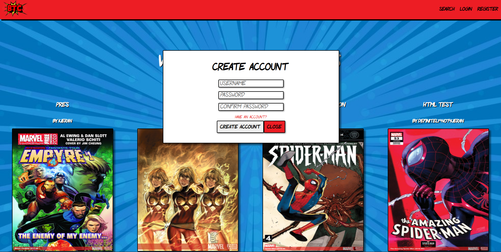
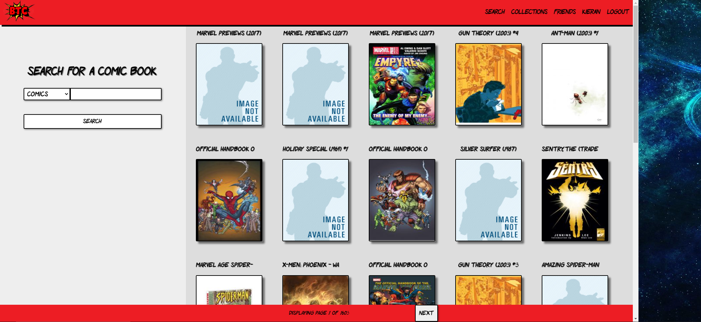
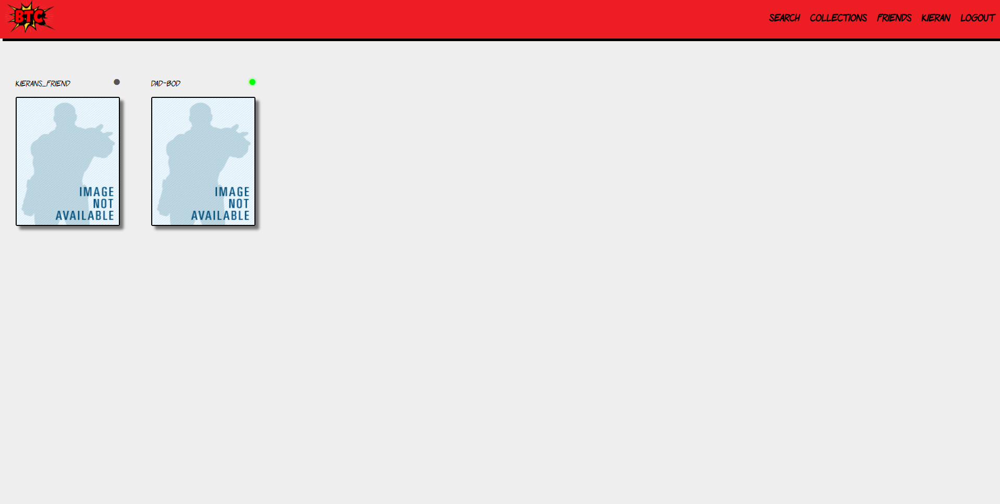
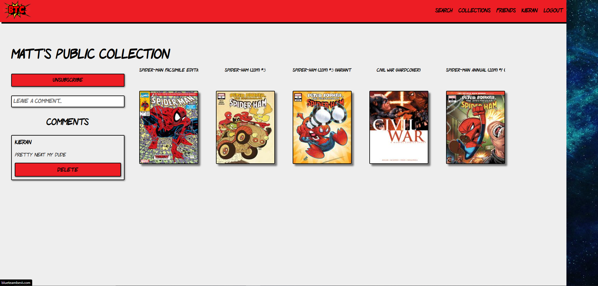
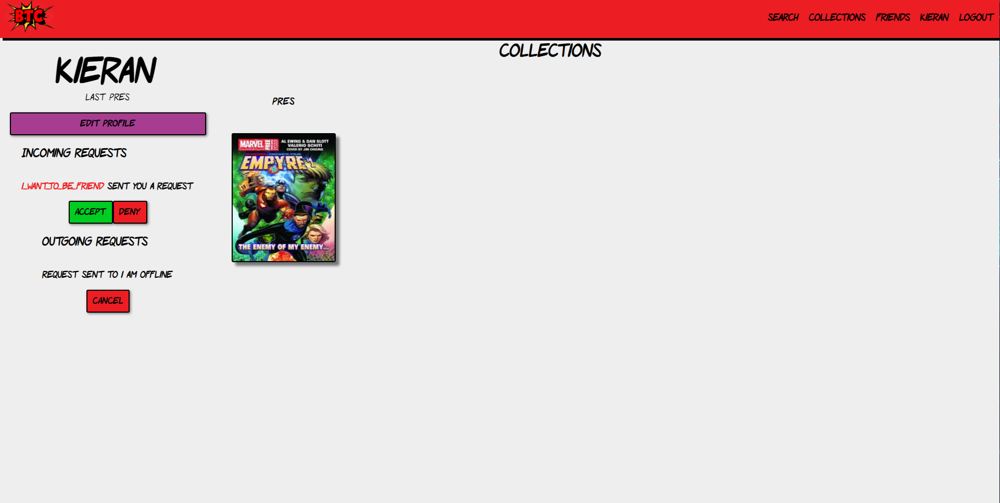

# Comic Collection Capstone

I and a small group were given 9 business days to build a full-stack web application requiring the use of Vue.js, a ProstgreSQL Database, an external API accessed via Spring Boot, and a Java Backend using RESTful API 
In addition, we were required to adhere to at least the following user stories

## User stories
- As an anonymous user, I should be able to:
  - create an account
  - log into an account
  - see a user's public collections
- As a logged-in user, I should be able to:
  - Create collections
  - Add comics to my collections
  - Remove comics from my collections
  - Delete collections
  - Add friends
  - Remove friends
  - View friends' private collections

We completed all of these within the allotted time and even more. The features that we added include the following:

## Web app Features
- # Registration/ login
  
  
  
- # Create/ delete collections
  
  
- # Search all marvel comics by name and add them to collections
  
  
  
- # Search users by name as well as see if they're online, send them friend requests, and view their collections
  
  
  
- # Search Collections by name, view the comics in them, and subscribe/unsubscribe to them to see them in your Collections tab
  
  

- # Accept, Deny, and Cancel Incoming/ Outgoing friend requests
  
- # Add comments to collections or delete your comments
  
- # Change your Description and Display name/Username
  
